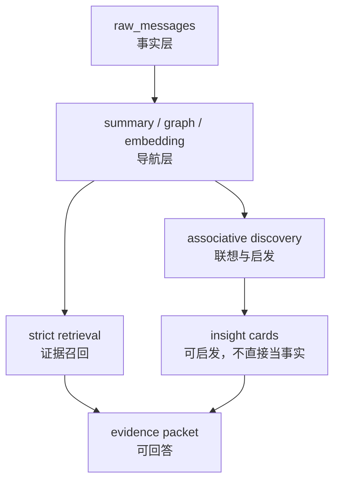
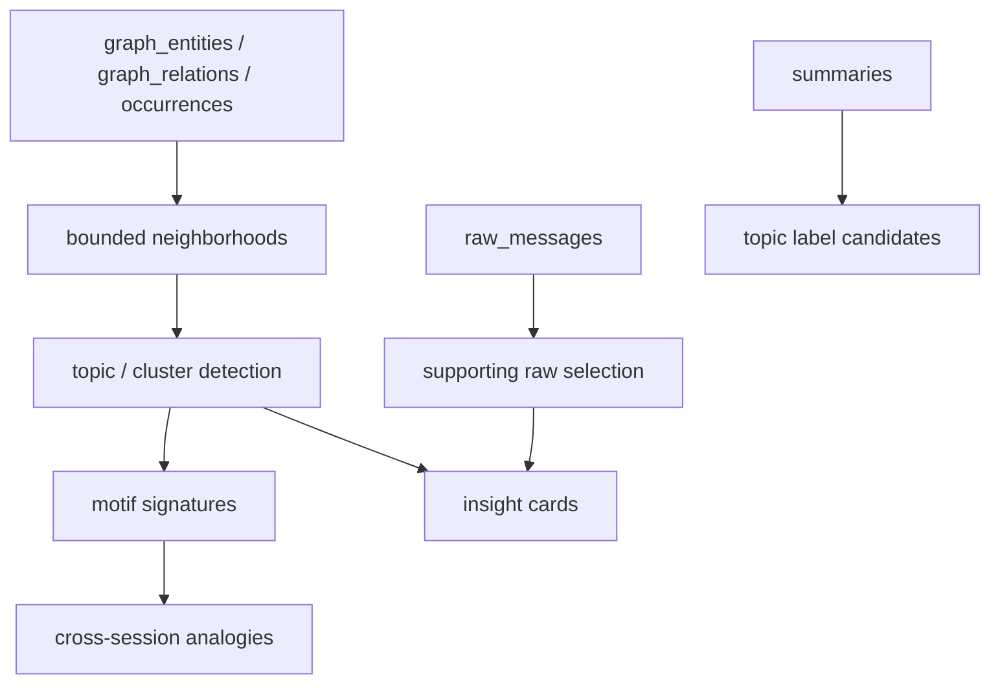

# OMS Associative Discovery 设计方案

日期：2026-05-08

## 结论

Graph v2 已经解决“长期稳定召回”和“边不爆炸”的底座问题，但它现在主要承担的是 evidence-backed retrieval：从 query 找实体、沿关系图有限扩展、回到 raw evidence。

接下来要新增的是第二层能力：**Associative Discovery**。它的目标不是替代证据检索，而是基于已有 raw、summary、graph、embedding 产物，主动发现：

1. 隐藏结构：哪些实体、主题、问题长期反复连接。
2. 抽象主题：多条 raw 背后共同指向的项目、矛盾、约束、设计原则。
3. 跨会话类比：当前问题和旧会话/旧项目的相似结构。
4. 方案灵感：给用户提示“也许可以从这个角度想”，但必须标注为 insight/hypothesis，不当作事实答案。

核心边界：

- `raw_messages` 仍然是事实来源。
- Graph / summary / embedding / discovery 都只是导航和启发。
- Discovery 产物可以主动提出灵感，但必须能列出 supporting raw ids。
- 没有 raw 支撑的内容只能叫 speculative prompt，不能进入 evidence packet。
- Discovery 不默认污染主上下文；只有用户显式调用、或策略允许的低风险提示，才进入对话。

## 设计定位

当前 OMS 分三层：



`Retrieval` 面向“回答问题”，必须严格回到 raw evidence。

`Discovery` 面向“帮用户想得更多”，输出结构化 insight cards，再由用户或后续检索决定是否展开为 evidence packet。

## 产品行为

### 用户显式触发

新增工具建议：

```text
oms_discover
```

输入：

- `query`: 当前问题、主题或项目名。
- `mode`: `theme | analogy | blindspot | inspiration | all`。
- `sessionId`: 可选，用于当前会话上下文。
- `limit`: 默认 5，最大 10。
- `evidencePolicy`: 默认 `general_history`，涉及材料时可为 `material_evidence`。

输出为 insight cards：

```json
{
  "kind": "analogy",
  "title": "OMS graph 爆炸问题类似旧的 summary 重复问题",
  "hypothesis": "两者都不是存储容量问题，而是 derived artifact 缺少稳定 identity 和增量边界。",
  "whyAssociated": [
    "共享实体：OMS, sqlite, summary, graph",
    "共享结构：derived rows grow faster than raw",
    "共享约束：raw must remain the truth source"
  ],
  "supportingRawIds": ["raw_...", "raw_..."],
  "supportingRelationIds": ["gr_..."],
  "novelty": 0.72,
  "confidence": 0.64,
  "risk": "hypothesis_not_fact",
  "nextQuestions": [
    "是否也要给 summary 增加 agent-scoped health/status 指标？",
    "是否应该把 derived artifact 的增长率统一纳入 dashboard？"
  ]
}
```

### 系统主动发现

后台发现不直接打扰用户。它只写入 `discovery_insights`，并在以下场景允许轻提示：

- 用户问“怎么设计/怎么改/有没有思路/有没有遗漏”。
- 当前 query 与高置信 insight 明显相关。
- insight 有至少 2 条 raw 支撑，且不是纯 assistant final answer。
- 同一 insight 最近没有提示过。

主动提示的语气必须是：

```text
我看到一个可能相关的结构，不是事实结论：...
```

不能写成：

```text
事实是...
```

## 数据模型

### discovery_runs

记录一次发现任务。

```sql
CREATE TABLE discovery_runs (
  run_id TEXT PRIMARY KEY,
  agent_id TEXT NOT NULL,
  mode TEXT NOT NULL,
  query TEXT,
  started_at TEXT NOT NULL,
  finished_at TEXT,
  source_graph_build_run_id TEXT,
  insights_created INTEGER NOT NULL DEFAULT 0,
  status TEXT NOT NULL,
  error TEXT,
  metadata_json TEXT NOT NULL DEFAULT '{}'
);
```

### discovery_topics

稳定主题/社区，不等于 summary。它是图上的 cluster 或 recurring pattern。

```sql
CREATE TABLE discovery_topics (
  topic_id TEXT PRIMARY KEY,
  agent_id TEXT NOT NULL,
  canonical_label TEXT NOT NULL,
  display_label TEXT NOT NULL,
  topic_kind TEXT NOT NULL,
  confidence REAL NOT NULL DEFAULT 0.5,
  novelty REAL NOT NULL DEFAULT 0.5,
  first_seen_at TEXT NOT NULL,
  last_seen_at TEXT NOT NULL,
  status TEXT NOT NULL DEFAULT 'active',
  metadata_json TEXT NOT NULL DEFAULT '{}',
  UNIQUE(agent_id, canonical_label, topic_kind)
);
```

`topic_kind` 初始值：

- `recurring_theme`
- `project_cluster`
- `constraint_cluster`
- `failure_pattern`
- `design_principle`

### discovery_topic_members

主题由哪些实体、关系、raw 支撑。

```sql
CREATE TABLE discovery_topic_members (
  topic_id TEXT NOT NULL,
  member_kind TEXT NOT NULL,
  member_id TEXT NOT NULL,
  agent_id TEXT NOT NULL,
  weight REAL NOT NULL DEFAULT 1.0,
  reason TEXT,
  metadata_json TEXT NOT NULL DEFAULT '{}',
  PRIMARY KEY(topic_id, member_kind, member_id)
);
```

`member_kind`：

- `entity`
- `relation`
- `raw`
- `summary`

### discovery_insights

用户可见的 insight card。

```sql
CREATE TABLE discovery_insights (
  insight_id TEXT PRIMARY KEY,
  agent_id TEXT NOT NULL,
  insight_kind TEXT NOT NULL,
  title TEXT NOT NULL,
  hypothesis TEXT NOT NULL,
  why_json TEXT NOT NULL DEFAULT '[]',
  supporting_raw_ids_json TEXT NOT NULL DEFAULT '[]',
  supporting_entity_ids_json TEXT NOT NULL DEFAULT '[]',
  supporting_relation_ids_json TEXT NOT NULL DEFAULT '[]',
  topic_ids_json TEXT NOT NULL DEFAULT '[]',
  confidence REAL NOT NULL DEFAULT 0.5,
  novelty REAL NOT NULL DEFAULT 0.5,
  diversity_key TEXT NOT NULL,
  status TEXT NOT NULL DEFAULT 'active',
  created_at TEXT NOT NULL,
  last_presented_at TEXT,
  metadata_json TEXT NOT NULL DEFAULT '{}'
);
```

`insight_kind`：

- `hidden_structure`
- `abstract_theme`
- `cross_session_analogy`
- `blindspot`
- `design_inspiration`
- `tension`

### discovery_feedback

让系统逐步知道哪些联想有用。

```sql
CREATE TABLE discovery_feedback (
  feedback_id TEXT PRIMARY KEY,
  agent_id TEXT NOT NULL,
  insight_id TEXT NOT NULL,
  feedback TEXT NOT NULL,
  created_at TEXT NOT NULL,
  metadata_json TEXT NOT NULL DEFAULT '{}'
);
```

`feedback`：

- `useful`
- `dismissed`
- `wrong`
- `too_obvious`
- `too_speculative`
- `expanded_to_evidence`

## 构建流程

### DiscoveryBuilder

新增模块：

```text
src/processing/DiscoveryBuilder.ts
src/storage/DiscoveryStore.ts
src/retrieval/lanes/AssociativeDiscoveryLane.ts
```

流程：



短期不引入新依赖。先用 SQLite + TypeScript 规则实现：

1. 从高权重 relation 和高 mention entity 找 local neighborhoods。
2. 用 session 分布、relation pattern、entity overlap 找 recurring topics。
3. 用 motif signature 找跨会话类比。
4. 用 bridge entity 找隐藏连接。
5. 用 novelty/diversity 排序，生成 insight cards。

### Motif Signature

类比不应该只是“词相同”。它要看结构相似：

```text
motif = {
  entityTypes: ["system", "database", "retrieval"],
  relationTypes: ["USES", "CONFIGURES", "CO_OCCURS_WITH"],
  problemShape: "derived artifact growth",
  constraints: ["raw is truth", "bounded retrieval", "agent scoped"]
}
```

第一阶段可以从已有 relation/entity metadata 和关键词规则生成，不调用 LLM。

未来可选 LLM extractor，但只能基于 raw excerpts，且输出必须保存 provenance。

## Scoring

Discovery 不是只按相似度排。它需要同时考虑相关性、新颖性、多样性和证据支撑。

推荐：

```text
score = relevance * 0.35
      + support * 0.25
      + novelty * 0.20
      + diversity * 0.15
      + recency * 0.05
```

### relevance

当前 query/session 与 topic/insight 的实体、关系、summary terms 的匹配度。

### support

支撑 raw 的数量和质量。

```text
support = min(1, log1p(raw_count) / log(5)) * avg_source_weight
```

source weight：

- `material_corpus`: 1.0
- `imported_timeline`: 0.9
- `general_chat`: 0.6
- `formal_question`: 0.4
- assistant final answer: 0，除非未来显式标记为 decision record。

### novelty

不要只返回最相似和最明显的东西。

```text
novelty = graph_distance_bonus
        + old_but_relevant_bonus
        + cross_session_bonus
        - repeated_recent_prompt_penalty
```

### diversity

同一次最多返回一个相同 `diversity_key` 的 insight，避免 5 张卡都讲同一个主题。

`diversity_key` 可以由：

```text
insight_kind + sorted(top_entity_ids) + top_relation_type
```

生成。

## 输出规则

每个 insight card 必须包含：

- `kind`
- `title`
- `hypothesis`
- `whyAssociated`
- `supportingRawIds`
- `confidence`
- `novelty`
- `risk`
- `nextQuestions`

如果 `supportingRawIds.length === 0`：

- 不进入默认输出。
- 只能在 `mode=speculative` 时返回。
- 必须标注 `risk = speculative_no_raw_support`。

如果用户要求“给我证据”：

- 调用 `oms_expand_evidence` 或 retrieval flow。
- Discovery card 本身不能当 evidence packet。

## 和现有 Graph v2 的关系

Graph v2 提供以下输入：

- entity identity
- typed relation
- occurrence provenance
- bounded traversal
- relation weight

Discovery 层新增的是：

- topic/community 聚合
- bridge detection
- analogy detection
- novelty/diversity ranking
- insight card lifecycle
- user feedback loop

Graph v2 的原则继续保留：

- search 不触发 full build。
- graph 不直接作为事实证据。
- 所有用户可见结论必须能回到 raw。
- agent scope 必须贯穿所有表和 status。

## 主动发现触发条件

后台任务可在这些事件后运行：

1. `graph_build_runs.status = succeeded`
2. 新增 raw 超过 N 条，默认 20。
3. 某个 entity/relation 的 occurrence_count 明显上升。
4. 用户显式调用 `oms_discover`。
5. 每日/每周维护任务。

默认不在每个 turn 后同步执行 discovery。它应该是低优先级后台任务，避免拖慢 OpenClaw。

## 安全边界

### 事实边界

Discovery 输出必须使用这些词：

- `hypothesis`
- `possible pattern`
- `analogy`
- `inspiration`
- `question`

避免：

- `fact`
- `confirmed`
- `proves`

除非已经展开 evidence packet。

### 污染边界

默认拒绝这些来源：

- assistant final answer
- OMS injected prompt context
- diagnostic/debug note
- tool summary
- storage receipt
- interrupted raw

### 提示注入边界

DiscoveryBuilder 只读 normalized/raw metadata 和 raw excerpts，不执行 raw 内容中的指令。

Insight card 里如果包含 raw 摘录，必须走现有 redaction/evidence packet 机制。

## 运维命令

后续 CLI 建议：

```bash
oms discover status
oms discover build --agent oms-agent-default
oms discover query --query "OMS graph memory" --mode analogy
oms discover explain --insight insight_...
oms discover feedback --insight insight_... --feedback useful
```

`status` 输出：

- discovery run count
- active topics
- active insights
- insights by kind
- average supporting raw count
- repeated/dismissed insight rate
- last run status
- no-raw-support insight count

## 验收测试

必须新增：

1. 同一 raw 重跑 discovery，不重复生成相同 insight。
2. 不从 assistant final answer 生成 insight。
3. 每个默认 insight 至少有 1 条 supporting raw。
4. cross-session analogy 必须来自至少 2 个不同 session。
5. diversity key 去重：同一批输出不返回重复主题卡。
6. `mode=theme` 只返回 topic/theme，不返回 analogy。
7. `mode=analogy` 返回的卡必须包含结构相似说明，而不是只有共享词。
8. feedback 写入后，dismissed insight 不再默认返回。
9. discovery 关闭时，不影响 `retrieveTool` 和 `GraphCteLane`。
10. status 全部按 agent_id 隔离。

## 实施阶段

### Phase 1：Schema + Store

新增 discovery 表和 `DiscoveryStore`。

不改现有 retrieval 行为。

### Phase 2：Deterministic DiscoveryBuilder

不用 LLM，不加依赖。

实现：

- topic detection
- bridge entities
- recurring relation motifs
- cross-session structural analogy

### Phase 3：Tool + Lane

新增 `oms_discover`。

`AssociativeDiscoveryLane` 只返回 insight candidates，不进入严格 evidence flow，除非用户要求展开证据。

### Phase 4：Prompt Card UX

把 insight card 渲染成简短、明确、有边界的用户提示。

格式：

```text
可能相关的结构：
...

为什么联想到：
...

可追溯材料：
...

下一步可以问：
...
```

### Phase 5：可选 LLM Captioner

只用于把 deterministic insight card 写得更像人话。

限制：

- 输入必须是 bounded raw excerpts + graph metadata。
- 输出必须保持 supporting raw ids。
- 不能新增 unsupported facts。
- 失败时 deterministic card 仍可用。

## 不做的事

短期不做：

- 不把 discovery card 当事实答案。
- 不在每条消息后同步跑复杂 discovery。
- 不引入大型图计算依赖。
- 不默认调用 LLM 给每条 raw 抽主题。
- 不把 assistant final answer 当长期事实来源。
- 不做无限深度图遍历。

## 成功标准

第一版成功标准：

- 能在真实 OMS DB 上生成 3-10 条非重复 insight cards。
- 每张默认卡有 raw 支撑。
- 至少能发现一种跨 session analogy。
- 正常 retrieval 测试不受影响。
- discovery status 可以解释为什么产生、为什么没产生、何时产生。
- 用户能区分“这是灵感”还是“这是证据事实”。

最终目标不是让 OMS 替用户做决定，而是让它在长期记忆里主动指出：

```text
这里可能有一个你没显式问到，但值得看的结构。
```
