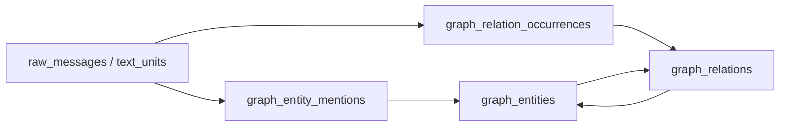
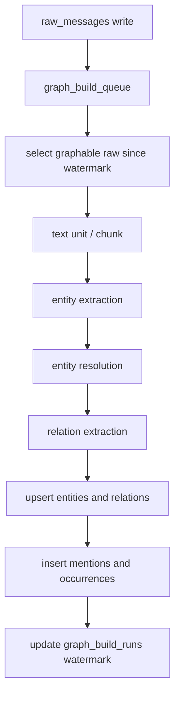
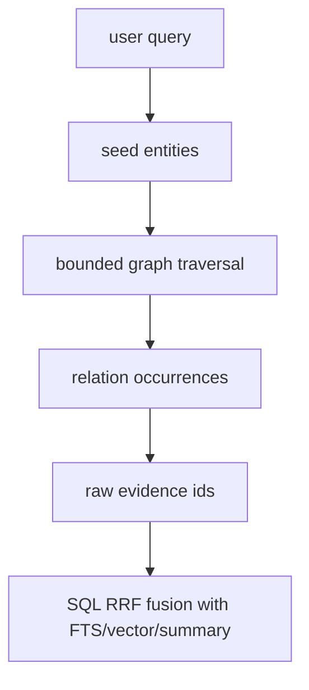

# OMS Graph v2 构建方案

日期：2026-05-08

## 结论

OMS 的 graph 应该定位为“长期记忆检索的稀疏证据图”，不是把每条消息里的词两两相连的无限共现图。

当前 v1 的 `co_mentions` 思路可以作为低置信 fallback，但不能作为主模型。长期稳定方案必须改成：

1. `raw_messages` / text units 是证据来源。
2. entity 是稳定节点，按 canonical identity 合并。
3. relationship 是聚合边，唯一键不包含 `source_raw_id`。
4. 每一次从文本里发现实体或关系，都写入 provenance/occurrence 表。
5. 检索时先找实体和聚合关系，再从 occurrence 展开到 raw evidence。

这会把 graph 从“消息越多边数线性甚至组合爆炸”改成“知识关系聚合增长，证据单独计数”的模型。

## 外部参考

调研依据：

- Microsoft GraphRAG 的索引流水线把原文拆成 `TextUnit`，再抽取 `Entity`、`Relationship`、可选 `Claim`，并把这些产物链接回来源 text units。其输出 schema 中 relationship 有 `source`、`target`、`weight`、`text_unit_ids`，说明关系应聚合并保留来源列表，而不是把来源写进关系 identity。参考：https://microsoft.github.io/graphrag/index/default_dataflow/ 和 https://microsoft.github.io/graphrag/index/outputs/
- GraphRAG 的 BYO graph 文档把最小图定义为 entities、relationships、text_units 三张逻辑表，并强调 relationships 的 `weight` 和 `text_unit_ids`。参考：https://microsoft.github.io/graphrag/index/byog/
- GraphRAG FastGraphRAG 承认 co-occurrence 是一种低成本方法，但建议更小 text chunks，并说明这种图更 noisy。参考：https://microsoft.github.io/graphrag/index/methods/
- W3C PROV 把 provenance 作为独立数据模型处理。OMS 应借这个思想，把“关系事实”和“关系从哪里来”分开。参考：https://www.w3.org/TR/prov-overview/
- Neo4j 建模指南建议从应用问题定义实体，关系要像 verb 一样具体、有方向，并通过唯一标识避免重复节点。参考：https://neo4j.com/docs/getting-started/data-modeling/tutorial-data-modeling/
- 自动知识图谱构建综述把 KG 建设拆为 acquisition、refinement、evolution 三类工作。OMS v2 也应按抽取、归并、演化维护拆阶段。参考：https://arxiv.org/abs/2302.05019

## 当前问题

当前实现位置：

- `src/processing/GraphBuilder.ts`
- `src/storage/GraphStore.ts`
- `src/retrieval/lanes/GraphCteLane.ts`

v1 问题：

1. `GraphBuilder` 从 raw message 抽 label 后，两两生成 `co_mentions`。
2. 原先一条消息最多 16 个 label，双向连边后单条消息可产生 168 条边。
3. `GraphStore.upsertEdge()` 的 edge id 是 `agent + from + to + relation + sourceRawId`，所以同一对实体在不同 raw 里会生成多条 graph edge。
4. `GraphCteLane.search()` 每次 search 都调用 `buildForAgent()`，相当于检索路径里混入全量索引构建。
5. `graph_nodes.source_raw_id` 只能保存一个来源，无法表达一个实体被多个 raw 支持。
6. `co_mentions` 只有一种关系类型，无法区分“配置了”“属于”“依赖”“只是同段出现”。

已做的止血：

- 跳过助手回复。
- 跳过 OMS 注入块。
- 每条消息最多 8 个 label。
- 连边窗口降到 3。
- 清理历史重复 summary 和旧 graph，当前 `raw=70 / summaries=70 / graph_nodes=29 / graph_edges=324`。

这些只是止血，不是最终标准实现。

## 目标模型

### 概念层



核心原则：

- `Entity` 是“东西”：产品、项目、文件、概念、人物、组织、时间、配置项。
- `Relationship` 是“事实或弱关系”：`USES`、`CONFIGURES`、`DEPENDS_ON`、`PART_OF`、`MENTIONS_WITH`。
- `Occurrence` 是“这条关系在哪段文本里被看到”。
- `Mention` 是“这个实体在哪段文本里被提到”。

### text unit

OMS 已有 `raw_messages`，可作为默认 text unit。长 material/import 文本再拆 chunk。

规则：

- 普通聊天：一个 `raw_message` 一个 text unit。
- `material_corpus` / `imported_timeline`：按 300-600 tokens chunk。
- 如果只是 co-occurrence fallback，chunk 应更小，目标 50-150 tokens。
- OMS 注入上下文、diagnostic、storage receipt、tool summary 不进 graph。
- assistant final answer 默认不进 graph；除非未来显式标记为 `assistant_decision_record` 并带来源。

## v2 Schema

### graph_entities

稳定实体表。

```sql
CREATE TABLE graph_entities (
  entity_id TEXT PRIMARY KEY,
  agent_id TEXT NOT NULL,
  entity_type TEXT NOT NULL,
  canonical_label TEXT NOT NULL,
  display_label TEXT NOT NULL,
  aliases_json TEXT NOT NULL DEFAULT '[]',
  description TEXT,
  confidence REAL NOT NULL DEFAULT 0.5,
  mention_count INTEGER NOT NULL DEFAULT 0,
  first_seen_at TEXT NOT NULL,
  last_seen_at TEXT NOT NULL,
  status TEXT NOT NULL DEFAULT 'active',
  metadata_json TEXT NOT NULL DEFAULT '{}',
  UNIQUE(agent_id, entity_type, canonical_label)
);
```

### graph_entity_mentions

实体证据表。

```sql
CREATE TABLE graph_entity_mentions (
  mention_id TEXT PRIMARY KEY,
  agent_id TEXT NOT NULL,
  entity_id TEXT NOT NULL,
  raw_id TEXT NOT NULL,
  turn_id TEXT,
  text_unit_id TEXT,
  extractor TEXT NOT NULL,
  extractor_version TEXT NOT NULL,
  start_char INTEGER,
  end_char INTEGER,
  mention_text TEXT NOT NULL,
  confidence REAL NOT NULL DEFAULT 0.5,
  created_at TEXT NOT NULL,
  metadata_json TEXT NOT NULL DEFAULT '{}',
  UNIQUE(agent_id, entity_id, raw_id, extractor, start_char, end_char)
);
```

### graph_relations

聚合关系表。注意：唯一键不包含 raw/source id。

```sql
CREATE TABLE graph_relations (
  relation_id TEXT PRIMARY KEY,
  agent_id TEXT NOT NULL,
  from_entity_id TEXT NOT NULL,
  to_entity_id TEXT NOT NULL,
  relation_type TEXT NOT NULL,
  directionality TEXT NOT NULL DEFAULT 'directed',
  description TEXT,
  weight REAL NOT NULL DEFAULT 1.0,
  confidence REAL NOT NULL DEFAULT 0.5,
  occurrence_count INTEGER NOT NULL DEFAULT 0,
  first_seen_at TEXT NOT NULL,
  last_seen_at TEXT NOT NULL,
  status TEXT NOT NULL DEFAULT 'active',
  metadata_json TEXT NOT NULL DEFAULT '{}',
  UNIQUE(agent_id, from_entity_id, to_entity_id, relation_type)
);
```

对于无向 co-occurrence：

- `relation_type = 'CO_OCCURS_WITH'`
- `directionality = 'undirected'`
- `from_entity_id/to_entity_id` 按 id 排序后写入
- 不再写反向边

对于语义关系：

- 使用具体动词，例如 `CONFIGURES`、`USES`、`DEPENDS_ON`、`PART_OF`、`LOCATED_IN`
- 保留方向

### graph_relation_occurrences

关系来源表。

```sql
CREATE TABLE graph_relation_occurrences (
  occurrence_id TEXT PRIMARY KEY,
  agent_id TEXT NOT NULL,
  relation_id TEXT NOT NULL,
  raw_id TEXT NOT NULL,
  turn_id TEXT,
  text_unit_id TEXT,
  extractor TEXT NOT NULL,
  extractor_version TEXT NOT NULL,
  rule_id TEXT,
  evidence_text_hash TEXT,
  start_char INTEGER,
  end_char INTEGER,
  strength REAL NOT NULL DEFAULT 1.0,
  confidence REAL NOT NULL DEFAULT 0.5,
  created_at TEXT NOT NULL,
  metadata_json TEXT NOT NULL DEFAULT '{}',
  UNIQUE(agent_id, relation_id, raw_id, extractor, rule_id, evidence_text_hash)
);
```

### graph_build_runs

增量构建状态表。

```sql
CREATE TABLE graph_build_runs (
  run_id TEXT PRIMARY KEY,
  agent_id TEXT NOT NULL,
  extractor_version TEXT NOT NULL,
  started_at TEXT NOT NULL,
  finished_at TEXT,
  high_watermark_sequence INTEGER,
  raw_scanned INTEGER NOT NULL DEFAULT 0,
  entities_upserted INTEGER NOT NULL DEFAULT 0,
  relations_upserted INTEGER NOT NULL DEFAULT 0,
  occurrences_inserted INTEGER NOT NULL DEFAULT 0,
  status TEXT NOT NULL,
  error TEXT,
  metadata_json TEXT NOT NULL DEFAULT '{}'
);
```

## 抽取策略

### 进入 graph 的 raw

允许：

- `role = user`
- `source_purpose in ('general_chat', 'material_corpus', 'formal_question', 'imported_timeline')`
- `retrieval_allowed = 1`

默认拒绝：

- assistant replies
- OMS injected prompt context
- diagnostic/debug/system-visible notices
- tool summaries
- storage receipts
- interrupted/partial messages

后续可新增显式类型：

- `assistant_decision_record`
- `project_fact`
- `user_confirmed_fact`

只有这些类型的 assistant 内容可以进 graph。

### Entity extraction

阶段 1：确定性抽取。

- backtick/code span 中的工具、文件、模块名。
- 路径、包名、命令名、配置键。
- 已知项目词表，例如 `OMS`、`OpenClaw`、`Paperclip`、`ChaunyOPC`。
- 显式 capture 标记里的 entity。
- 英文 proper noun 只作为候选，不能无脑入图。

阶段 2：归一化。

- NFKC。
- trim、多空格折叠。
- case fold。
- alias map：`openclaw` / `OpenClaw` 合并。
- entity type 参与 identity，避免 `Agent` 这个普通词污染所有关系。

阶段 3：低置信合并保护。

- 自动合并只允许 exact canonical match。
- fuzzy merge 必须进入 `pending_aliases` 或低置信队列，不能直接改 entity identity。

### Relationship extraction

关系分两类。

#### Semantic relation

优先级最高。

来源：

- 规则：`X uses Y`、`X depends on Y`、`X configures Y`、`X is stored at path`。
- 未来可选 LLM extractor：只跑 material/import/用户确认的事实，不跑普通闲聊。

写法：

- directed。
- relation type 具体。
- description 简短。
- occurrence 必须指向 raw/text unit。

#### Co-occurrence fallback

只作为召回辅助。

规则：

- 只在同一个 text unit 内。
- text unit 小于阈值，建议 50-150 tokens。
- 每个 text unit 最多 8 个 entity。
- 每个 entity 最多连接 top 3 邻居。
- 无向边只存一条。
- confidence 默认 0.25-0.45。
- 不能用于最终事实回答，只能用于找候选 raw。

## 权重与增长控制

relation weight 不应无限线性增长。

推荐：

```text
weight = min(10, log1p(occurrence_count) * avg_confidence * source_weight)
```

source weight：

- `material_corpus`: 1.0
- `imported_timeline`: 0.9
- `formal_question`: 0.7
- `general_chat`: 0.5
- `assistant_decision_record`: 0.6，仅未来显式开启

硬性阈值：

- 每个 text unit entity <= 8。
- 每个 text unit relation occurrence <= 24。
- `CO_OCCURS_WITH` occurrence <= 12。
- graph lane query seed <= 12。
- traversal fanout <= 8。
- traversal depth <= 2。
- 单次 graph lane 返回 raw candidates <= 20。

健康指标：

- duplicate relation rows = 0。
- duplicate occurrence rows = 0。
- `graph_relations / raw_messages` 长期目标 < 8。
- `CO_OCCURS_WITH / semantic_relation` 如果持续大于 5，说明语义抽取不足或 co-occurrence 太宽。
- assistant-origin graph occurrence 目标为 0，除非显式开关。

## 构建流程

### Ingest path



### Search path



`GraphCteLane` 不应在 search 内触发全量 build。它只读已经构建好的 graph。

## 迁移计划

### Phase 0：已完成止血

- 限制 graph 输入源。
- 跳过助手和 OMS prompt。
- 降低 label 和 fanout。
- 清理当前 DB 中重复 summary 和旧 graph。

### Phase 1：Schema v2

新增：

- `graph_entities`
- `graph_entity_mentions`
- `graph_relations`
- `graph_relation_occurrences`
- `graph_build_runs`

保留 v1 `graph_nodes/graph_edges` 一段时间，只作为兼容读或迁移回滚。

### Phase 2：Builder v2

新增 `GraphBuilderV2`：

- `buildIncremental(agentId)`
- `buildRaw(rawMessage)`
- `rebuildAgent(agentId)`
- `extractEntities(textUnit)`
- `extractRelations(textUnit, entities)`

`GraphStoreV2`：

- `upsertEntity`
- `insertMention`
- `upsertRelation`
- `insertOccurrence`
- `refreshRelationStats`

### Phase 3：GraphCteLane v2

改为读取 `graph_entities/graph_relations/graph_relation_occurrences`。

排序建议：

```text
score = seed_match_score
      + relation_weight
      + occurrence_confidence
      - depth_penalty
      - stale_penalty
```

返回 candidate 时必须带：

- `rawIdHint`
- `graphPath`
- `relationIds`
- `occurrenceIds`
- `evidenceRequired: true`

### Phase 4：Backfill / Rebuild

步骤：

1. 停 gateway。
2. 备份 sqlite。
3. 建 v2 表。
4. 从 `raw_messages` 全量重建 v2 graph。
5. 对比指标。
6. 切 `GraphCteLane` 到 v2。
7. 启 gateway。
8. 观察 24 小时。
9. 删除或归档 v1 graph。

## 验收测试

必须新增测试：

1. 同一 raw 重跑 builder，不新增 duplicate entities/relations/occurrences。
2. 同一实体对在多个 raw 出现，只产生 1 条 `graph_relations`，occurrence_count 增加。
3. co-occurrence 无向关系只存一条，不存双向边。
4. assistant final answer 默认不进 graph。
5. OMS prompt context 不进 graph。
6. search 不触发 full build。
7. source evidence 能从 relation occurrence 展开回 raw。
8. `rebuildAgent` 前后 relation count 稳定。
9. graph lane 在空 graph 时降级为空候选，不报错。
10. migration 从 v1 DB 到 v2 DB 可重复执行。

## 运维命令建议

后续加脚本：

```bash
oms graph status
oms graph rebuild --agent oms-agent-default --backup
oms graph vacuum --agent oms-agent-default
oms graph explain --query "paperclip memory"
```

`status` 输出：

- raw count
- graphable raw count
- entity count
- relation count
- occurrence count
- duplicate rows
- relation/raw ratio
- top noisy entities
- top noisy relation types
- last build run

## 不做的事

短期不做：

- 不引入新依赖做复杂中文分词。
- 不默认对每条聊天调用 LLM 抽关系。
- 不做社区检测和 community report，除非数据量和需求证明值得。
- 不把 summary 当证据直接入图；summary 只能导航，证据必须回 raw。

## 长期方向

当 raw 数量明显增长后，再考虑：

- semantic relation LLM extractor，只处理 material/import/user-confirmed fact。
- entity community detection，用于长期主题摘要。
- alias review 队列，避免自动误合并。
- relation aging，降低很久未被使用的弱 co-occurrence 权重。
- graph export/import，支持审计和重建。

## 实施顺序

建议按以下 PR 拆分：

1. `graph-v2-schema`：迁移表和 store 方法。
2. `graph-v2-builder`：实体/关系/occurrence 聚合构建。
3. `graph-v2-lane`：GraphCteLane 读 v2，不在 search 中 build。
4. `graph-v2-rebuild-cli`：备份、清表、重建、状态输出。
5. `graph-v1-retire`：确认稳定后移除 v1 写路径。

